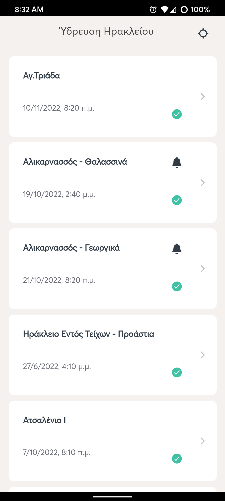
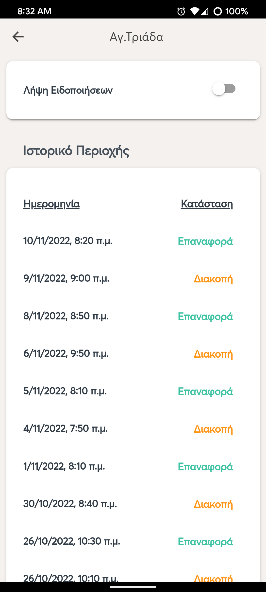

# Welcome

Heraklion Water was born by the fact that the city i live in has often unexpected water cut-offs. This can lead at broken appliances e.g washing machine, dishwasher or consuming water while there is no supply for not critical tasks.

In the need of an Android application that will inform me of water cut-offs as soon as they happen and the thrill of learning new frameworks and libraries i wrote this app.

##### Backend:

- NodeJS, ExpressJS, Mongoose ORM

##### Frontend:

- ReactJS, Ionic, Capacitor, Firebase Cloud Messaging(Push Notifications)

# Features

#### Implemented:

- Get current area based on geolocation
- Subscribe to area push notifications
- Receive push notification on water distribution status change
- Overview area history

# Android App Installation

- .apk available to install

# Preview

    

    

